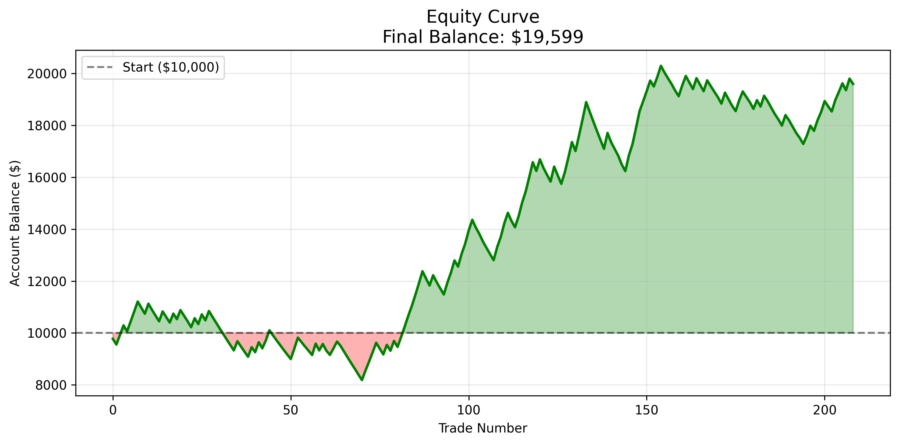
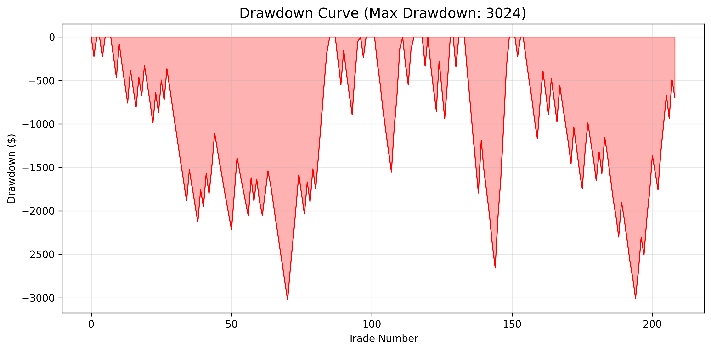
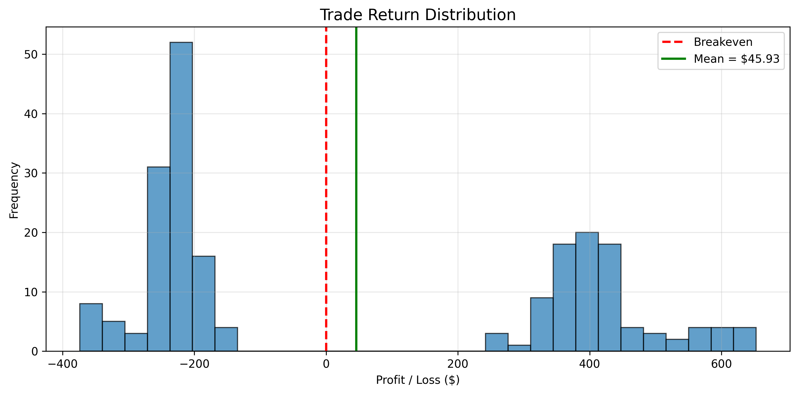

# Multi Asset Trading Back-tester

## Overview

This project implements a systematic trend-following strategy across multiple indices.

## Features

- ATR-based risk management
- Dynamic position sizing
- Portfolio aggregation
- Monte Carlo simulation
- Trade journal generation
- Equity curve analysis
- Drawdown analysis

## Strategy Logic

### Entry Conditions

- Close above Fast SMA
- Open below Fast SMA
- ATR above threshold
- Fast SMA below Slow SMA
- Negative Slow SMA slope

### Exit Conditions

- 2R Take Profit
- 1R Stop Loss

## Risk Management

- Risk per trade: 2% of account equity
- Dynamic position sizing based on ATR stop distance
- Fixed 2R reward-to-risk ratio
- Portfolio-level performance tracking

## Performance

| Metric | Value |
|----------|----------|
| Trades | 209 |
| Win Rate | 43.06% |
| Profit Factor | 1.34 |
| Sharpe Ratio | 2.19 |
| Return | 95.99% |
| Max Drawdown | 36.94% |

## Equity Curve

## Drawdown Analysis

## Trade Return Distribution

## Monte Carlo Analysis

Trade outcomes were randomly reordered to evaluate sensitivity to trade sequencing.

Worst 5% Outcomes:

| Metric | Value |
|----------|----------|
| Portfolio Value | $11,744 |
| Maximum Drawdown | -$5,117 |

## Motivation

The objective of this project was to develop a complete multi-asset trading strategy framework capable of:

- Generating trading signals
- Applying risk-based position sizing
- Tracking portfolio performance
- Measuring risk metrics
- Evaluating robustness through Monte Carlo simulation

The project was built as part of my quantitative finance and Python learning journey.

## Technology Stack

- Python
- Pandas
- NumPy
- Matplotlib
- mplfinance

## Future Improvements

- Value at Risk (VaR)
- Expected Shortfall (ES)
- Walk-forward testing
- Parameter optimization
- Additional asset classes
- Multi-timeframe analysis
